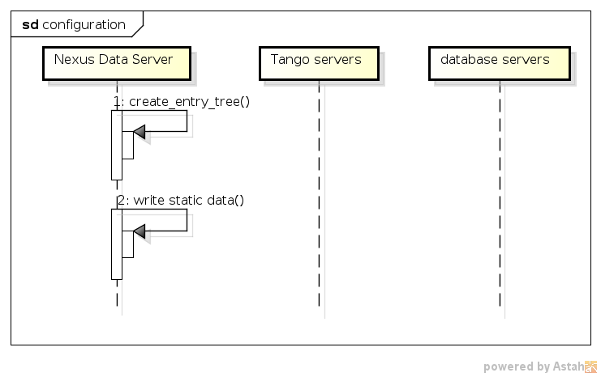
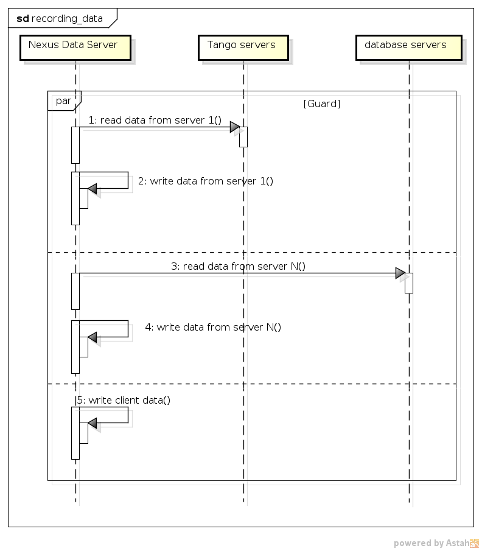

NXDL extensions for data sources
================================

In order to describe various data sources `the NXDL
standard <http://download.nexusformat.org/sphinx/nxdl.html>`__ has been
extended by XML tags listed below. Thus, ``<strategy />`` and
``<datasource />`` tags can be situated inside

* ``<field />`` -- for its value
* ``<attribute />`` -- for its value
* ``<dim />`` -- for  its value (from nxswriter v1.7.0)
* ``<link />`` -- for its target (from nxswriter v1.9.0)

The other ones are nested inside ``<datasource/>`` tag.

The ``<strategy>`` tag
----------------------

The **strategy** tag defines when and in which way the data is stored.
An example of usage:

.. code-block:: xml

    <field name="energy" type="NX_FLOAT" units="GeV" >
      <strategy mode="STEP" trigger="trigger1" />
      <datasource type="CLIENT">
        <record name="counter_1"/>
      </datasource>
    </field>

The tag can have the following attributes:

* **mode** specifies when the data is fetched, i.e.

  * *INIT* during opening a new entry
  * *STEP* when the *record()* command is performed
  * *FINAL* at the time of closing the entry
  * *POSTRUN* during post-processing stage
  * *CONFIG* before opening a new entry (used only for dimensions)

* **trigger** stands for the name of the related trigger in asynchronous *STEP* mode (optional)

* **grows** selects which a field dimension grows of in the STEP mode. The default growing dimension is the first one, i.e. grows=1 (optional)

* **compression** specifies if data is compressed (optional)

  * *true* data going to be compressed
  * *false* data stored without compression (default)

* **rate** compression rate (optional)

  * from *0* to *9*

* **shuffle** compression shuffle (optional)

  * *true* shuffle enabled (default)
  * *false* shuffle disabled

* **canfail** specifies if during reading data exception should be thrown (optional)

  * *false* on error exception is raised (default)
  * *true* on error

warning info is printed and the record is filled by a maximum value for
the record type

The **content** of the strategy tags is an label describing data merged
into the H5 file by a post-processing program.

An example of usage:

.. code-block:: xml

    <field name="energy" type="NX_FLOAT" units="GeV" >
      <strategy mode="POSTRUN" >
        http://haso.desy.de:/data/energy.dat
      </strategy>
    </field>

The ``<datasource>`` tag
------------------------

The **datasource** tag specifies a type of the used data sources. They
can be one of built types, i.e. *CLIENT*, *TANGO*, *DB*, *PYEVAL* or
external ones -- defined in external python package and registered via
JSON data.

The ``<datasouce>`` tag acquires the following attributes:

* **type** related to a type of data source with possible values:

  * *CLIENT* for communication with client via JSON strings
  * *TANGO* for taking data from Tango servers
  * *DB* for fetching data from databases
  * *PYEVAL* for evaluating data from other data sources by python script
  * *other type name* of data source which has been registered via JSON data.

* **name** datasource name (optional)

*CLIENT* datasource
-------------------

The CLIENT datasource allows to read data from client JSON strings. It
should contain a ``<record />`` tag. An example of usage:

.. code-block:: xml

    <datasource type="CLIENT" name="exp_c01">
      <record name="counter_1"/>
    </datasource>

``<record>``
~~~~~~~~~~~~

The **record** tag defines the fetched data by its name. It has an
attrbute

* **name** which for the *CLIENT* data source type denotes a name of the data in the JSON string.

An example of usage:

.. code:: xml

    <record name="Position"/>

*TANGO* datasource
------------------

The TANGO datasource allows to read data from other TANGO devices. It
should contain ``<device/>`` and ``<record/>`` tags. An example of
usage:

.. code-block:: xml

    <datasource type="TANGO">
      <device hostname="haso.desy.de" member="attribute" name="p09/motor/exp.01" port="10000" encoding="LIMA_VIDEO_IMAGE"/>
      <record name="Position"/>
    </datasource>

``<device>``
~~~~~~~~~~~~

The **device** tag describes the Tango device which is used to get the
data. It has the following attributes:

* **name** corresponding to a name of the Tango device

* **member** defining a type of the class member, i.e.

  * *attribute* an attribute to read
  * *command* a result of a command to take
  * *property* a property to read

* **hostname** a name of the host with the Tango device server (optional)

* **port** a port number related to the Tango device server (optional)

* **encoding** a label defining a required decoder for ``DevEncoded`` data (optional)

* **group** tango group name (optional)

If **group** attribute is defined data of the same group is read
simultaneously and only ones during one experimental step.

``<record>``
~~~~~~~~~~~~

The **record** tag defines the fetched data by its name. It has an
attrbute

* **name** which for the *TANGO* data source type a name of the tango class member.

*DB* datasource
---------------

The DB datasource allows to read data from accessible databases. It
should contain ``<database />`` and ``<query>`` tags. An example of
usage:

.. code-block:: xml

    <datasource type="DB">
      <database dbname="tango" dbtype="MYSQL" hostname="haso.desy.de"/>
      <query format="SPECTRUM">
        SELECT pid FROM device limit 10
      </query>
    </datasource>

``<database>``
~~~~~~~~~~~~~~

The **database** tag specifies parameters to connect to the required
database. It acquires the attirbutes

* **dbtype** describing a type of the database, i.e.

  * *ORACLE* an ORACLE database
  * *MYSQL* a MySQL database
  * *PGSQL* a PostgreSQL database

* **dbname** denoting a name of the database (optional)

* **hostname** being a name of the host with the database (optional)

* **port** corresponding to a port number related to the database (optional)

* **user** denoting a user name (optional)

* **passwd** being a user password (optional)

* **mycnf** defining a location of the my.cnf file with MySQL database access configuration (optional)

* **node** corresponding to a node parameter for the ORACLE database(optional)

The **content** of the database tag defines Oracle DSN string (optional)

``<query>``
~~~~~~~~~~~

The **query** tag defines the database query which fetches the data. It
has one attribute

* **format** which specifies a dimension of the fetch data, i.e.

  * *SCALAR* corresponds to 0-dimensional data, e.g. a separate numerical value or string
  * *SPECTRUM* is related to 1-dimensional data, e.g. a list of numerical values or strings
  * *IMAGE* describes 2-dimensional data, i.e. a table of specific type values, e.g. a table of strings

The **content** of the query tags is the SQL query

Another example of usage:

.. code-block:: xml

    <datasource type="DB">
      <database dbname="mydb" dbtype="PGSQL"/>
      <query format="IMAGE">
        SELECT * FROM weather limit 3
      </query>
    </datasource>

*PYEVAL* datasource
-------------------

The PYEVAL datasource allows to read data from other datasources and
evaluate it by a user python script. An example of usage:

.. code-block:: xml

    <datasource type="PYEVAL">

      <datasource type="TANGO" name="position">
        <device hostname="haso.desy.de" member="attribute" name="p09/motor/exp.01" port="10000"/>
        <record name="Position"/>
      </datasource>

      <datasource type="CLIENT" name="shift">
        <record name="exp_c01"/>
      </datasource>

      <result name="finalposition">
        ds.finalposition = ds.position + ds.shift
      </result>

    </datasource>

``<datasource>``
~~~~~~~~~~~~~~~~

The PYEVAL datasource can contain other datasources. They have to have
defined name attributes. Those names with additional prefix 'ds.'
correspond to input variable names from the python script, i.e.
ds.\ **name**.

``<result>``
~~~~~~~~~~~~

The **result** contains python script which evaluates input data. It has
the following attribute:
* **name** corresponding to a result name. It
is related to python script variable by *ds.\ **name***. The default
value **name**\ ="result". (optional)

Sequence diagrams
=================

.. image:: files/basic_server_client_communication.png

